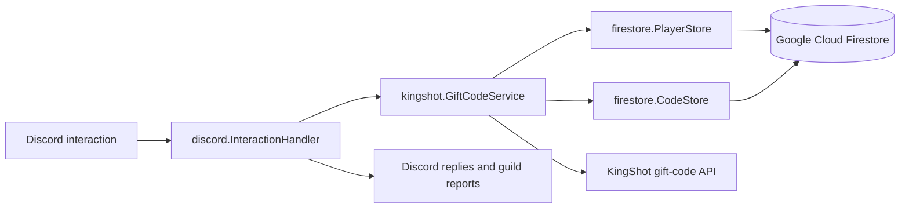

# kingshot

`kingshot` is a Discord bot and Go service for registering KingShot players and redeeming gift codes for them. Player registrations and gift-code state are stored in Google Cloud Firestore, while redemptions are sent to the KingShot gift-code API through a signed, rate-limited HTTP client.

## Features

- Register up to two player IDs per Discord user and kingdom.
- List the players linked to a Discord account.
- Transfer a registered player to another kingdom.
- Unlink a player with an ephemeral confirmation prompt.
- Submit a gift code once and redeem it for every active player.
- Automatically redeem active codes when a new player registers.
- Keep active and expired codes in Firestore to prevent duplicate processing.
- Post redemption results to each affected Discord guild.

## Discord commands

| Command | Description |
| --- | --- |
| `/player register player-id:<id> kingdom-id:<id>` | Link a KingShot player to the invoking Discord user and redeem active codes. |
| `/player status` | Show the invoking user's active player registrations. |
| `/player transfer player-id:<id> new-kingdom-id:<id>` | Move a linked player to another kingdom. |
| `/player unlink player-id:<id>` | Confirm and remove the link, excluding the player from future redemptions. |
| `/code code:<gift-code>` | Validate a gift code and redeem it for all active players. |

Commands are registered globally. Discord can take time to propagate global command changes.

## How the bot is wired



The executable in `cmd/discord` performs the startup wiring:

1. Parse command-line flags, environment variables, and `.env`.
2. Create a Discord session from the bot token.
3. Create a Firestore client and the player and code stores.
4. Construct `kingshot.GiftCodeService` with both stores.
5. Attach the Discord interaction handler with `discord.Register`.
6. Open the Discord WebSocket connection.
7. On Discord's `Ready` event, create the current global commands and remove stale commands.
8. Wait for `SIGINT` or `SIGTERM`, then close the session.

The service serializes mutations with a mutex. Its KingShot HTTP client has a 10-second timeout and limits requests to one every two seconds.

When `/code` succeeds, results are grouped by the guild where each player registered. The bot posts each report to the guild's system channel, then its public-updates channel, or finally its first text channel.

## Project structure

```text
.
├── api.go                    # KingShot API payload signing and redemption client
├── service.go                # Registration, transfer, unlink, and code workflows
├── result.go                 # Structured service results
├── store.go                  # PlayerStore and CodeStore contracts
├── in_memory_code_store.go   # Default non-persistent CodeStore
├── cmd/discord/
│   └── main.go               # Bot entrypoint and dependency wiring
├── discord/
│   ├── handler.go            # Slash commands and Discord event handlers
│   └── format.go             # User-facing result formatting
├── firestore/
│   ├── service.go            # Firestore client construction
│   ├── player.go             # Firestore PlayerStore
│   └── code.go               # Firestore CodeStore
└── docs/
		└── code-store-refactor-plan.md
```

Tests live beside the packages they cover in `*_test.go` files.

## Requirements

- Go 1.25 or newer.
- A Discord application with a bot user.
- A Google Cloud project with Firestore enabled.
- Application Default Credentials with read/write access to Firestore.

Invite the bot with the `bot` and `applications.commands` OAuth2 scopes. It needs permission to view channels and send messages in guilds where redemption reports should appear.

## Configuration

Configuration can be supplied as flags, environment variables, or entries in a `.env` file.

| Flag / `.env` key | Required | Description |
| --- | --- | --- |
| `bot_token` | Yes | Discord bot token. |
| `firestore_project_id` | Yes | Google Cloud project containing the Firestore database. |

Example `.env`:

```dotenv
BOT_TOKEN=replace-with-your-discord-bot-token
FIRESTORE_PROJECT_ID=your-gcp-project-id
```

Do not commit `.env` or a real bot token.

For local development, authenticate Google Cloud Application Default Credentials before starting the bot:

```bash
gcloud auth application-default login
```

## Run

```bash
go run ./cmd/discord
```

Equivalent flags can be passed directly:

```bash
go run ./cmd/discord \
	-bot_token "$BOT_TOKEN" \
	-firestore_project_id "$FIRESTORE_PROJECT_ID"
```

Stop the bot with `Ctrl+C`.

## Test

```bash
go test ./...
```

Most service and handler tests use test doubles and do not require Discord or Firestore credentials.
