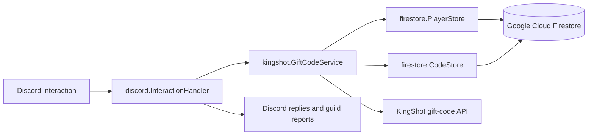

# kingshot

`kingshot` is a Discord bot and Go service for registering KingShot players and redeeming gift codes for them. Player registrations and gift-code state are stored in Google Cloud Firestore, while redemptions are sent to the KingShot gift-code API through a signed, rate-limited HTTP client.

## Features

- Register up to two player IDs per Discord user and kingdom.
- List the players linked to a Discord account.
- Transfer a registered player to another kingdom.
- Unlink a player with an ephemeral confirmation prompt.
- Submit a gift code once and redeem it for every active player.
- Automatically redeem active codes when a new player registers.
- Keep active and expired codes in Firestore to prevent duplicate processing.
- Post redemption results to each affected Discord guild.
- Configure bear trap schedules and view their current status.
- Send bear reminders before each scheduled event, with a per-trap reminder channel.
- Disable bear reminders without deleting the configured bear schedule.
- Configure a minimum Discord role for bot management commands, with automatic access for higher roles and a Manage Server or Administrator fallback.

## Discord commands

| Command | Description |
| --- | --- |
| `/player register player-id:<id> kingdom-id:<id>` | Link a KingShot player to the invoking Discord user and redeem active codes. |
| `/player status` | Show the invoking user's active player registrations. |
| `/player transfer player-id:<id> new-kingdom-id:<id>` | Move a linked player to another kingdom. |
| `/player unlink player-id:<id>` | Confirm and remove the link, excluding the player from future redemptions. |
| `/code redeem code:<gift-code>` | Validate a gift code and redeem it for all active players. |
| `/code channel channel:<channel>` | Set the channel where gift-code redemption results are posted. |
| `/bear status trap:<1\|2>` | Show a bear trap's next event, configured-by user, and reminder state. |
| `/bear set trap:<1\|2> date:<YYYY-MM-DD> time:<HH:MM>` | Set the next bear event in UTC and enable reminders. Requires the configured access role or a role above it; defaults to Manage Server or Administrator permission. |
| `/bear disable trap:<1\|2>` | Disable reminders for a bear trap while retaining its configured schedule. Requires the configured access role or a role above it; defaults to Manage Server or Administrator permission. |
| `/bear channel channel:<channel>` | Set the channel for bear reminders. Requires the configured access role or a role above it; defaults to Manage Server or Administrator permission. |
| `/access view` | Show the configured minimum role for bot management commands. |
| `/access set role:<role>` | Set the minimum role required to use bot management commands. |
| `/access reset confirm:true` | Reset command access to the default Manage Server or Administrator requirement. |

Commands are registered globally. Discord can take time to propagate global command changes.

## Command access control

Server administrators can use `/access set role:<role>` to configure the minimum role for bot management commands. Members with the selected role, or any role positioned above it in the server's role hierarchy, can use those commands. Members with Manage Server or Administrator permission always retain access.

Use `/access view` to inspect the current setting and `/access reset confirm:true` to restore the default Manage Server or Administrator requirement.

Access control deliberately uses a minimum position in Discord's role hierarchy rather than requiring administrators to select multiple roles, configure individual permissions, or create a dedicated bot role. This design prioritizes ease of use: existing server roles work without additional setup or ongoing role lists to maintain.

This tradeoff means that every member with a role positioned at or above the configured role receives access, even when their particular role was not selected explicitly. That behavior may not suit every server, but it was chosen as the least burdensome of the available approaches. Place the configured role carefully within the server's role hierarchy.

## How the bot is wired



The executable in `cmd/discord` performs the startup wiring:

1. Parse command-line flags, environment variables, and `.env`.
2. Create a Discord session from the bot token.
3. Create a Firestore client and the player and code stores.
4. Construct `kingshot.GiftCodeService` with both stores.
5. Attach the Discord interaction handler with `discord.Register`.
6. Open the Discord WebSocket connection.
7. On Discord's `Ready` event, create the current global commands and remove stale commands.
8. Wait for `SIGINT` or `SIGTERM`, then close the session.

The service serializes mutations with a mutex. Its KingShot HTTP client has a 10-second timeout and limits requests to one every two seconds.

When `/code` succeeds, results are grouped by the guild where each player registered. The bot posts each report to the configured redemption channel when available; otherwise it uses the guild's system channel, then public-updates channel, or finally the first text/news channel where it has permission to post.

## Bear reminders

Bear schedules are stored in Firestore and cached in memory. The scheduler checks enabled schedules every minute. When an event has passed, it advances the stored next event by exact 48-hour intervals from the previous event time, avoiding schedule drift. About 30 minutes before an event, it sends one reminder to the configured bear channel, or an available guild fallback channel when none is configured.

`/bear set` always enables reminders for the selected trap. `/bear disable` leaves the next scheduled time intact but removes that trap from reminder scheduling. `/bear status` continues to show disabled traps and their retained schedule.

## Project structure

```text
.
├── api.go                    # KingShot API payload signing and redemption client
├── bear.go                   # Bear scheduling and reminder service
├── service.go                # Registration, transfer, unlink, and code workflows
├── result.go                 # Structured service results
├── store.go                  # PlayerStore and CodeStore contracts
├── in_memory_code_store.go   # Default non-persistent CodeStore
├── store/
│   └── inmem.go              # Cached BearStore wrapper
├── api/
│   ├── cookies.go             # OAuth state and privacy session cookies
│   └── handler.go             # Privacy deletion HTTP handlers
├── cmd/
│   ├── api/
│   │   └── main.go            # App Engine privacy API entrypoint
│   └── discord/
│       └── main.go            # VM-hosted Discord bot entrypoint
├── discord/
│   ├── handler.go            # Slash commands and Discord event handlers
│   └── format.go             # User-facing result formatting
├── firestore/
│   ├── service.go            # Firestore client construction
│   ├── player.go             # Firestore PlayerStore
│   ├── code.go               # Firestore CodeStore
│   ├── bear.go               # Firestore BearStore
│   ├── alliance.go            # Firestore AllianceStore
│   └── privacy.go             # Firestore privacy deletion service
├── PRIVACY.md                # Privacy policy
├── TERMS.md                  # Terms of service
└── app.yaml                  # Local App Engine deployment configuration
```

Tests live beside the packages they cover in `*_test.go` files.

## Requirements

- Go 1.25 or newer.
- A Discord application with a bot user.
- A Google Cloud project with Firestore enabled.
- Application Default Credentials with read/write access to Firestore.

Invite the bot with the `bot` and `applications.commands` OAuth2 scopes. It needs permission to view channels and send messages in guilds where redemption reports should appear.

## Configuration

Configuration can be supplied as flags, environment variables, or entries in a `.env` file. The Discord bot and privacy API use different configuration values.

### Discord bot

| Flag / `.env` key | Required | Description |
| --- | --- | --- |
| `bot_token` | Yes | Discord bot token. |
| `firestore_project_id` | Yes | Google Cloud project containing the Firestore database. |

Example `.env`:

```dotenv
BOT_TOKEN=replace-with-your-discord-bot-token
FIRESTORE_PROJECT_ID=your-gcp-project-id
```

### Privacy API

| Flag / environment variable | Required | Description |
| --- | --- | --- |
| `discord_client_id` | Yes | Discord OAuth application client ID. |
| `discord_client_secret` | Local only | Discord OAuth application client secret. When omitted, it is loaded from Secret Manager. |
| `discord_client_secret_name` | No | Secret Manager secret ID. Defaults to `discord_client_secret`. |
| `discord_redirect_uri` | Yes | OAuth callback URI registered with Discord. |
| `signing_key` | Local only | HMAC key used to sign privacy session cookies. When omitted, it is loaded from Secret Manager. |
| `signing_key_name` | No | Secret Manager secret ID. Defaults to `signing_key`. |
| `firestore_project_id` | Yes | Google Cloud project containing the Firestore database. |

For App Engine, `app.yaml` contains only the Secret Manager secret IDs. The runtime service account needs the `roles/secretmanager.secretAccessor` role on both secrets. The production callback URI is:

```text
https://kingshot-8539b.ew.r.appspot.com/oauth/discord/callback
```

Do not commit `.env`, `app.yaml`, or real credentials.

For local development, authenticate Google Cloud Application Default Credentials before starting the bot:

```bash
gcloud auth application-default login
```

## Run

Run the Discord bot locally:

```bash
go run ./cmd/discord
```

Equivalent flags can be passed directly:

```bash
go run ./cmd/discord \
	-bot_token "$BOT_TOKEN" \
	-firestore_project_id "$FIRESTORE_PROJECT_ID"
```

Stop the bot with `Ctrl+C`.

Run the privacy API locally:

```bash
go run ./cmd/api
```

The privacy API listens on port `8080` by default. Its deletion flow is available at `/delete`.

Deploy the privacy API to App Engine from the repository root:

```bash
gcloud app deploy app.yaml
```

## Release and deployment

Pull requests targeting `main` run the build and race-enabled test suite. Merging
to `main` does not deploy the production bot. To make a production release:

1. Update `CHANGELOG.md`, moving the relevant entries from `Unreleased` into a
	dated version section.
2. Merge that change to `main`.
3. Create and push a version tag from the release commit, for example:

	```bash
	git tag v0.2.2
	git push origin v0.2.2
	```

4. The tag workflow builds and deploys the bot to the production VM. The
	workflow uses the GitHub `production` environment, where deployment
	approval rules can be configured.

The App Engine privacy API is deployed separately with `gcloud app deploy
app.yaml`.

## Test

```bash
go test ./...
```

Most service and handler tests use test doubles and do not require Discord or Firestore credentials.

## Policies

Read the [Privacy Policy](PRIVACY.md) and [Terms of Service](TERMS.md) before using the service.
